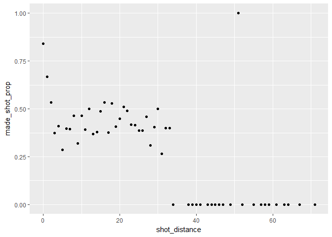
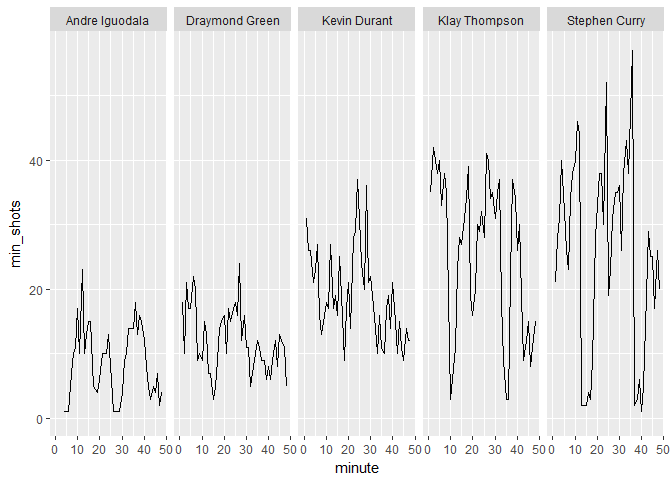

HW 02 - Shot Charts
================
Matthew Clagett
March 8, 2018

``` r
library(dplyr)
```

    ## 
    ## Attaching package: 'dplyr'

    ## The following objects are masked from 'package:stats':
    ## 
    ##     filter, lag

    ## The following objects are masked from 'package:base':
    ## 
    ##     intersect, setdiff, setequal, union

``` r
library(ggplot2)
```

### Total number of shots (2PT and 3PT, both made and missed) by player, arranged in descending order

``` r
shots <- read.csv("../data/shots-data.csv")
View(shots)
shots %>% group_by(name) %>% summarise(total = sum(shot_made_flag == "made shot"))
```

    ## # A tibble: 5 x 2
    ##             name total
    ##           <fctr> <int>
    ## 1 Andre Iguodala   192
    ## 2 Draymond Green   245
    ## 3   Kevin Durant   495
    ## 4  Klay Thompson   575
    ## 5  Stephen Curry   584

### Create the three tables listed below to summarize Effective Sooting percentages by player.

##### 1. Effective Shooting % by Player: Overall effective shooting percentage by player, arranged in descending order by percentage.

``` r
shots %>% group_by(name) %>% 
     summarise(total = sum(!is.na(shot_made_flag)),
                                       made = sum(shot_made_flag == "made shot"),
                                       perc_made = made/total) %>%
     arrange(desc(perc_made))
```

    ## # A tibble: 5 x 4
    ##             name total  made perc_made
    ##           <fctr> <int> <int>     <dbl>
    ## 1   Kevin Durant   915   495 0.5409836
    ## 2 Andre Iguodala   371   192 0.5175202
    ## 3  Klay Thompson  1220   575 0.4713115
    ## 4  Stephen Curry  1250   584 0.4672000
    ## 5 Draymond Green   578   245 0.4238754

##### 2. 2PT Effective Shooting % by Player: 2 PT Field Goal effective shooting percentage by player, arranged in descending order by percentage.

``` r
shots %>% group_by(name) %>% 
     filter(shot_type == "2PT Field Goal") %>%
     summarise(total = sum(!is.na(shot_made_flag)),
                                       made = sum(shot_made_flag == "made shot"),
                                       perc_made = made/total) %>%
     arrange(desc(perc_made))
```

    ## # A tibble: 5 x 4
    ##             name total  made perc_made
    ##           <fctr> <int> <int>     <dbl>
    ## 1 Andre Iguodala   210   134 0.6380952
    ## 2   Kevin Durant   643   390 0.6065319
    ## 3  Stephen Curry   563   304 0.5399645
    ## 4  Klay Thompson   640   329 0.5140625
    ## 5 Draymond Green   346   171 0.4942197

##### 3. 3PT Effective Shooting % by Player: 3 PT Field Goal effective shooting percentage by player, arranged in descending order by percentage

``` r
shots %>% group_by(name) %>% 
     filter(shot_type == "3PT Field Goal") %>%
     summarise(total = sum(!is.na(shot_made_flag)),
                                       made = sum(shot_made_flag == "made shot"),
                                       perc_made = made/total) %>%
     arrange(desc(perc_made))
```

    ## # A tibble: 5 x 4
    ##             name total  made perc_made
    ##           <fctr> <int> <int>     <dbl>
    ## 1  Klay Thompson   580   246 0.4241379
    ## 2  Stephen Curry   687   280 0.4075691
    ## 3   Kevin Durant   272   105 0.3860294
    ## 4 Andre Iguodala   161    58 0.3602484
    ## 5 Draymond Green   232    74 0.3189655

###### Consider the following question: the shorter the shooting distance, the higher the chance to successfully make a shot? Intuition and experience will suggest that YES. To confirm this, you will have to calculate, for each distance value, the proportion of made shots.

``` r
shots_made_distance <- shots %>% group_by(shot_distance) %>% 
     summarise(made_shot_prop = sum(shot_made_flag == "made shot")/sum(!is.na(shot_made_flag)))
shots_made_distance
```

    ## # A tibble: 56 x 2
    ##    shot_distance made_shot_prop
    ##            <int>          <dbl>
    ##  1             0      0.8410758
    ##  2             1      0.6683673
    ##  3             2      0.5335689
    ##  4             3      0.3734940
    ##  5             4      0.4107143
    ##  6             5      0.2857143
    ##  7             6      0.3958333
    ##  8             7      0.3953488
    ##  9             8      0.4634146
    ## 10             9      0.3207547
    ## # ... with 46 more rows

###### Use ggplot() to make a scatterplot with the variables shot\_distance and made\_shot\_prop. Use the x axis for the shot distance, and the y axis for the proportion of made shots

``` r
ggplot(shots_made_distance) + geom_point(aes(x = shot_distance,
                                         y = made_shot_prop))
```

 It looks as though the shots that are made right at the basket, which are likely the dunks, layups, etc, are a very high proportion of made shots. The rest rest of the distances are very spread out, with a distance of about 18 ft being a good place to shoot from. At 51 ft, one person made a shot. After about 32 feet, it is very unlikely that a shot will be made, or attempted. Shots from 0-3 feet tend to have a percentage of 50% or more of shots made. There are also a few others at 12, 16, 18, and 30 feet that tend to be made more than 50% of the time.

###### Total number of shots for every player by minute of occurance

``` r
shots_each_min <- shots %>% group_by(minute, name) %>% summarise(min_shots = sum(!is.na(name)))
shade <- data.frame(x1=c(0,12), x2=c(24,36), y1=c(0,50), y2=c(0,50))
ggplot(shots_each_min) + geom_path(aes(x=minute, y=min_shots)) + facet_grid(. ~ name) + scale_x_continuous() +
     geom_rect(data = shade, mapping=aes(xmin=x1, xmax=x2, ymin=y1, ymax=y2), fill="grey",alpha=0.5)
```


